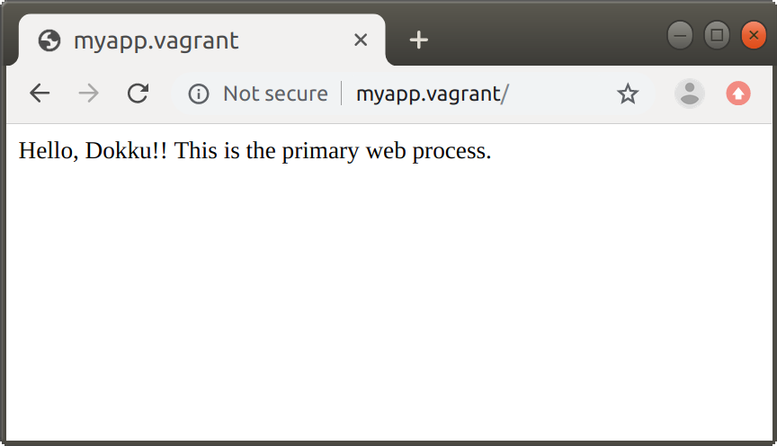

# Environments

```bash
$ dokku version
dokku version 0.19.0

$ uname -a
Linux vagrant 4.15.0-65-generic #74-Ubuntu SMP Tue Sep 17 17:06:04 UTC 2019 x86_64 x86_64 x86_64 GNU/Linux

$ cat /etc/issue
Ubuntu 18.04.3 LTS \n \l

$ hostname
vagrant
```


# Reproduction

Every commands below are run inside the VM where dokku is running on, unless otherwise specified.

## App creation

```bash
$ ssh dokku@192.168.33.10 apps:create myapp
-----> Creating myapp... done
```


## Deploy

```bash
# Prepare for this reproduction code
$ git clone git@github.com:belltailjp/dokku-additional-web-process-502-issue.git
$ cd dokku-additional-web-process-502-issue
$ git remote add dokku dokku@192.168.33.10:myapp

# Do deploy!!
$ git push dokku master:master
perl: warning: Setting locale failed.
perl: warning: Please check that your locale settings:
        LANGUAGE = "en_US:",
        LC_ALL = (unset),
        LC_MEASUREMENT = "ja_JP.UTF-8",
        LC_PAPER = "ja_JP.UTF-8",
        LC_MONETARY = "ja_JP.UTF-8",
        LC_NAME = "ja_JP.UTF-8",
        LC_ADDRESS = "ja_JP.UTF-8",
        LC_NUMERIC = "ja_JP.UTF-8",
        LC_TELEPHONE = "ja_JP.UTF-8",
        LC_IDENTIFICATION = "ja_JP.UTF-8",
        LC_TIME = "ja_JP.UTF-8",
        LANG = "en_US.UTF-8"
    are supported and installed on your system.
perl: warning: Falling back to a fallback locale ("en_US.UTF-8").
Counting objects: 9, done.
Delta compression using up to 8 threads.
Compressing objects: 100% (7/7), done.
Writing objects: 100% (9/9), 1.75 KiB | 1.75 MiB/s, done.
Total 9 (delta 1), reused 0 (delta 0)
-----> Cleaning up...
-----> Building myapp from herokuish...
-----> Adding BUILD_ENV to build environment...
-----> Python app detected
-----> Installing python-3.6.8
-----> Installing pip
-----> Installing SQLite3
-----> Installing requirements with pip
       Collecting Flask==1.1.1 (from -r /tmp/build/requirements.txt (line 1))
       Downloading https://files.pythonhosted.org/packages/9b/93/628509b8d5dc749656a9641f4caf13540e2cdec85276964ff8f43bbb1d3b/Flask-1.1.1-py2.py3-none-any.whl (94kB)
       Collecting gunicorn==19.9.0 (from -r /tmp/build/requirements.txt (line 2))
       Downloading https://files.pythonhosted.org/packages/8c/da/b8dd8deb741bff556db53902d4706774c8e1e67265f69528c14c003644e6/gunicorn-19.9.0-py2.py3-none-any.whl (112kB)
       Collecting click>=5.1 (from Flask==1.1.1->-r /tmp/build/requirements.txt (line 1))
       Downloading https://files.pythonhosted.org/packages/fa/37/45185cb5abbc30d7257104c434fe0b07e5a195a6847506c074527aa599ec/Click-7.0-py2.py3-none-any.whl (81kB)
       Collecting Werkzeug>=0.15 (from Flask==1.1.1->-r /tmp/build/requirements.txt (line 1))
       Downloading https://files.pythonhosted.org/packages/ce/42/3aeda98f96e85fd26180534d36570e4d18108d62ae36f87694b476b83d6f/Werkzeug-0.16.0-py2.py3-none-any.whl (327kB)
       Collecting itsdangerous>=0.24 (from Flask==1.1.1->-r /tmp/build/requirements.txt (line 1))
       Downloading https://files.pythonhosted.org/packages/76/ae/44b03b253d6fade317f32c24d100b3b35c2239807046a4c953c7b89fa49e/itsdangerous-1.1.0-py2.py3-none-any.whl
       Collecting Jinja2>=2.10.1 (from Flask==1.1.1->-r /tmp/build/requirements.txt (line 1))
       Downloading https://files.pythonhosted.org/packages/65/e0/eb35e762802015cab1ccee04e8a277b03f1d8e53da3ec3106882ec42558b/Jinja2-2.10.3-py2.py3-none-any.whl (125kB)
       Collecting MarkupSafe>=0.23 (from Jinja2>=2.10.1->Flask==1.1.1->-r /tmp/build/requirements.txt (line 1))
       Downloading https://files.pythonhosted.org/packages/b2/5f/23e0023be6bb885d00ffbefad2942bc51a620328ee910f64abe5a8d18dd1/MarkupSafe-1.1.1-cp36-cp36m-manylinux1_x86_64.whl
       Installing collected packages: click, Werkzeug, itsdangerous, MarkupSafe, Jinja2, Flask, gunicorn
       Successfully installed Flask-1.1.1 Jinja2-2.10.3 MarkupSafe-1.1.1 Werkzeug-0.16.0 click-7.0 gunicorn-19.9.0 itsdangerous-1.1.0

-----> Discovering process types
       Procfile declares types -> web, web2
-----> Releasing myapp (dokku/myapp:latest)...
-----> Deploying myapp (dokku/myapp:latest)...
-----> App Procfile file found (/home/dokku/myapp/DOKKU_PROCFILE)
-----> DOKKU_SCALE file not found in app image. Generating one based on Procfile...
       DOKKU_SCALE declares scale -> web=1 web2=0
-----> Attempting pre-flight checks
       CHECKS file not found in container: Running simple container check...
       For more efficient zero downtime deployments, create a file CHECKS. See http://dokku.viewdocs.io/dokku/deployment/zero-downtime-deploys/ for examples
-----> Waiting for 10 seconds ...
-----> Default container check successful!
-----> Running post-deploy
-----> Creating new /home/dokku/myapp/VHOST...
-----> Configuring myapp.vagrant...(using built-in template)
-----> Creating http nginx.conf
       Reloading nginx
-----> Renaming containers
       Renaming container (92e736902713) sharp_allen to myapp.web.1
=====> Application deployed:
       http://myapp.vagrant

To 192.168.33.10:myapp
 * [new branch]      master -> master
```


## Prepare processes

We need to explicitly prepare for processes of both `web` and `web2`.

```bash
$ ssh dokku@192.168.33.10 ps:report myapp
=====> myapp ps information
       Processes:                     1
       Deployed:                      true
       Running:                       true
       Restore:                       true
       Restart policy:                on-failure:10
       Ps can scale:                  true
       Status web.1:                  running    (CID: 92e736902713)

$ ssh dokku@192.168.33.10 ps:scale myapp web=1 web2=1
-----> Scaling myapp:web to 1
-----> Scaling myapp:web2 to 1
-----> Releasing myapp (dokku/myapp:latest)...
-----> Deploying myapp (dokku/myapp:latest)...
-----> App Procfile file found (/home/dokku/myapp/DOKKU_PROCFILE)
       DOKKU_SCALE declares scale -> web=1 web2=1
-----> Attempting pre-flight checks
       CHECKS file not found in container: Running simple container check...
       For more efficient zero downtime deployments, create a file CHECKS. See http://dokku.viewdocs.io/dokku/deployment/zero-downtime-deploys/ for examples
-----> Waiting for 10 seconds ...
-----> Default container check successful!
-----> Attempting pre-flight checks
       Non web container detected: Running default container check...
-----> Waiting for 10 seconds ...
-----> Default container check successful!
-----> Running post-deploy
-----> Configuring myapp.vagrant...(using built-in template)
-----> Creating http nginx.conf
       Reloading nginx
-----> Renaming containers
       Found previous container(s) (645c3570e091) named myapp.web.1
       Renaming container (645c3570e091) myapp.web.1 to myapp.web.1.1571302699
       Renaming container (5fd8793d5cca) stoic_pasteur to myapp.web.1
       Found previous container(s) (847dd78a051a) named myapp.web2.1
       Renaming container (847dd78a051a) myapp.web2.1 to myapp.web2.1.1571302699
       Renaming container (9d66d48979c0) hardcore_lewin to myapp.web2.1
-----> Shutting down old containers in 60 seconds
       645c3570e0911119d274c3cd39bd88655d5457447e766eb074d5241151a4b3fb
       847dd78a051a95164031cf3dccee1bd98d4e6b07020e1b3876b02bb7f418c676
=====> Application deployed:
       http://myapp.vagrant
```


## Open port for the secondary web process

```bash
$ ssh dokku@192.168.33.10 proxy:ports-add myapp http:5555:5555
-----> Configuring myapp.vagrant...(using built-in template)
-----> Creating http nginx.conf
       Reloading nginx

$ ssh dokku@192.168.33.10 proxy:report myapp
=====> myapp proxy information
       Proxy enabled:                 true
       Proxy type:                    nginx
       Proxy port map:                http:5555:5555 http:80:5000
```


## Make the app visible from the host

```bash
$ echo "192.168.33.10 myapp.vagrant" | sudo tee -a /etc/hosts
```


# Phenomenon

The `web` process accessed through http://myapp.vagrant/ perfectly works fine.




However the `web2` one http://myapp.vagrant:5555/ doesn't.


In the nginx log I can find `111: Connection refused`.

```bash
$ ssh dokku@192.168.33.10 nginx:error-logs myapp
2019/10/17 09:05:33 [error] 6267#6267: *32 connect() failed (111: Connection refused) while connecting to upstream, client: 192.168.33.1, server: myapp.vagrant, request: "GET / HTTP/1.1", upstream: "http://172.17.0.19:5555/", host: "myapp.vagrant:5555"
2019/10/17 09:05:33 [error] 6267#6267: *32 connect() failed (111: Connection refused) while connecting to upstream, client: 192.168.33.1, server: myapp.vagrant, request: "GET /favicon.ico HTTP/1.1", upstream: "http://172.17.0.19:5555/favicon.ico", host: "myapp.vagrant:5555", referrer: "http://myapp.vagrant:5555/"
```


# Workaround

I found in the app-local nginx config that both process types have the same local IP destination.

The below observations are all done in the server VM (in my case `192.168.33.10`)

```bash
$ sudo tail /home/dokku/myapp/nginx.conf
upstream myapp-5555 {

  server 172.17.0.19:5555;
}

upstream myapp-5000 {

  server 172.17.0.19:5000;
}

```


The local IP `172.17.0.19` is for primary web process (`web`).

```bash
$ sudo docker ps
CONTAINER ID        IMAGE                COMMAND                  CREATED             STATUS              PORTS               NAMES
c6d117f01b72        dokku/myapp:latest   "/start web2"            13 minutes ago      Up 13 minutes                           myapp.web2.1
70258e811ea5        dokku/myapp:latest   "/start web"             13 minutes ago      Up 13 minutes                           myapp.web.1

$ sudo docker inspect -f '{{range .NetworkSettings.Networks}}{{.IPAddress}}{{end}}' myapp.web.1
172.17.0.19

$ sudo docker inspect -f '{{range .NetworkSettings.Networks}}{{.IPAddress}}{{end}}' myapp.web2.1
172.17.0.20
```

Therefore, based on the configuration generated by dokku, nginx transfers requests sent to the host port 5555 to the container for the primary process, where no one in the container is watching its 5555 port.
This results in 502 bad gateway error.


If I manually correct the config file as follows,

```text
...

  upstream myapp-5555 {
  
-   server 172.17.0.19:5555;
+   server 172.17.0.20:5555;
  }
  
  upstream myapp-5000 {
  
    server 172.17.0.19:5000;
  }

```

and then reload nginx,

```bash
$ sudo service nginx restart
```

I can get the `web2` work as expected.


It does not break the behavior of primary process (`web`).


## Note: 1 process on port 5555

In the above case, I had two processes inside an app with the following proxy settings.
- `web` http:80:5000
- `web2` http:5555:5555

When I have only one web process like follows, it works as expected.
- `web` http:5555:5555

I confirmed it by the following procedure.

- Disable `web2` process by ps:scale
- Modify Procfile to only this 1 line: `web: gunicorn app1:app --workers=1 -b 0.0.0.0:5555`
- Remove http:80:5000 port mapping
- Deploy
- Access to `hhtp://myapp.vagrant:5555` and see response from the primary web process.


# App info

Here is my app info

```bash
$ ssh dokku@192.168.33.10 report myapp
-----> uname: Linux vagrant 4.15.0-65-generic #74-Ubuntu SMP Tue Sep 17 17:06:04 UTC 2019 x86_64 x86_64 x86_64 GNU/Linux
-----> memory: 
                     total        used        free      shared  buff/cache   available
       Mem:            985         371         168           0         445         457
       Swap:           979         751         228
-----> docker version: 
       Client: Docker Engine - Community
        Version:           19.03.3
        API version:       1.40
        Go version:        go1.12.10
        Git commit:        a872fc2f86
        Built:             Tue Oct  8 00:59:59 2019
        OS/Arch:           linux/amd64
        Experimental:      false
       
       Server: Docker Engine - Community
        Engine:
         Version:          19.03.3
         API version:      1.40 (minimum version 1.12)
         Go version:       go1.12.10
         Git commit:       a872fc2f86
         Built:            Tue Oct  8 00:58:31 2019
         OS/Arch:          linux/amd64
         Experimental:     false
        containerd:
         Version:          1.2.10
         GitCommit:        b34a5c8af56e510852c35414db4c1f4fa6172339
        runc:
         Version:          1.0.0-rc8+dev
         GitCommit:        3e425f80a8c931f88e6d94a8c831b9d5aa481657
        docker-init:
         Version:          0.18.0
         GitCommit:        fec3683
-----> docker daemon info: 
WARNING: No swap limit support
       Client:
        Debug Mode: true
       
       Server:
        Containers: 34
         Running: 18
         Paused: 0
         Stopped: 16
        Images: 75
        Server Version: 19.03.3
        Storage Driver: overlay2
         Backing Filesystem: extfs
         Supports d_type: true
         Native Overlay Diff: true
        Logging Driver: json-file
        Cgroup Driver: cgroupfs
        Plugins:
         Volume: local
         Network: bridge host ipvlan macvlan null overlay
         Log: awslogs fluentd gcplogs gelf journald json-file local logentries splunk syslog
        Swarm: inactive
        Runtimes: runc
        Default Runtime: runc
        Init Binary: docker-init
        containerd version: b34a5c8af56e510852c35414db4c1f4fa6172339
        runc version: 3e425f80a8c931f88e6d94a8c831b9d5aa481657
        init version: fec3683
        Security Options:
         apparmor
         seccomp
          Profile: default
        Kernel Version: 4.15.0-65-generic
        Operating System: Ubuntu 18.04.3 LTS
        OSType: linux
        Architecture: x86_64
        CPUs: 2
        Total Memory: 985.3MiB
        Name: vagrant
        ID: JAOH:SWWS:AUK6:3U22:KUA2:ZUZU:QTCA:PPAI:EVTJ:DNW7:ICMB:LLSB
        Docker Root Dir: /var/lib/docker
        Debug Mode: false
        Registry: https://index.docker.io/v1/
        Labels:
        Experimental: false
        Insecure Registries:
         127.0.0.0/8
        Live Restore Enabled: false
       
-----> sigil version: 0.4.0
-----> herokuish version: 
       herokuish: 0.5.3
       buildpacks:
         heroku-buildpack-multi     v1.0.0
         heroku-buildpack-ruby      v201
         heroku-buildpack-nodejs    v161
         heroku-buildpack-clojure   v84
         heroku-buildpack-python    v154
         heroku-buildpack-java      v63
         heroku-buildpack-gradle    v30
         heroku-buildpack-scala     v85
         heroku-buildpack-play      v26
         heroku-buildpack-php       v159
         heroku-buildpack-go        v126
         buildpack-nginx            v12
-----> dokku version: dokku version 0.19.0
-----> dokku plugins: 
       plugn: 0.3.2
         00_dokku-standard    0.19.0 enabled    dokku core standard plugin
         20_events            0.19.0 enabled    dokku core events logging plugin
         app-json             0.19.0 enabled    dokku core app-json plugin
         apps                 0.19.0 enabled    dokku core apps plugin
         builder-dockerfile   0.19.0 enabled    dokku core builder-dockerfile plugin
         builder-herokuish    0.19.0 enabled    dokku core builder-herokuish plugin
         buildpacks           0.19.0 enabled    dokku core buildpacks plugin
         certs                0.19.0 enabled    dokku core certificate management plugin
         checks               0.19.0 enabled    dokku core checks plugin
         common               0.19.0 enabled    dokku core common plugin
         config               0.19.0 enabled    dokku core config plugin
         docker-options       0.19.0 enabled    dokku core docker-options plugin
         domains              0.19.0 enabled    dokku core domains plugin
         enter                0.19.0 enabled    dokku core enter plugin
         git                  0.19.0 enabled    dokku core git plugin
         logs                 0.19.0 enabled    dokku core logs plugin
         mysql                1.9.1 enabled    dokku mysql service plugin
         network              0.19.0 enabled    dokku core network plugin
         nginx-vhosts         0.19.0 enabled    dokku core nginx-vhosts plugin
         plugin               0.19.0 enabled    dokku core plugin plugin
         proxy                0.19.0 enabled    dokku core proxy plugin
         ps                   0.19.0 enabled    dokku core ps plugin
         redis                1.10.0 enabled    dokku redis service plugin
         repo                 0.19.0 enabled    dokku core repo plugin
         resource             0.19.0 enabled    dokku core resource plugin
         scheduler-docker-local 0.19.0 enabled    dokku core scheduler-docker-local plugin
         shell                0.19.0 enabled    dokku core shell plugin
         ssh-keys             0.19.0 enabled    dokku core ssh-keys plugin
         storage              0.19.0 enabled    dokku core storage plugin
         tags                 0.19.0 enabled    dokku core tags plugin
         tar                  0.19.0 enabled    dokku core tar plugin
         trace                0.19.0 enabled    dokku core trace plugin
=====> myapp app information
       App dir:                       /home/dokku/myapp        
       Git sha:                       895cc7a                  
       Deploy source:                 git                      
       Locked:                        false                    
=====> myapp buildpacks information
       Buildpacks list:               
=====> myapp ssl information
       Ssl dir:                       /home/dokku/myapp/tls    
       Ssl enabled:                   false                    
       Ssl hostnames:                                          
       Ssl expires at:                                         
       Ssl issuer:                                             
       Ssl starts at:                                          
       Ssl subject:                                            
       Ssl verified:                                           
=====> myapp checks information
       Checks disabled list:          none                     
       Checks skipped list:           none                     
=====> myapp docker options information
       Docker options build:                                   
       Docker options deploy:         --restart=on-failure:10  
       Docker options run:                                     
=====> myapp domains information
       Domains app enabled:           true                     
       Domains app vhosts:            myapp.vagrant            
       Domains global enabled:        true                     
       Domains global vhosts:         vagrant                  
=====> myapp git information
       Git deploy branch:             master                   
       Git global deploy branch:      master                   
       Git keep git dir:              false                    
       Git rev env var:               GIT_REV                  
=====> myapp network information
       Network bind all interfaces:   false
       Network listeners:             172.17.0.19:5000
=====> myapp proxy information
       Proxy enabled:                 true                     
       Proxy type:                    nginx                    
       Proxy port map:                http:5555:5555 http:80:5000
=====> myapp ps information
       Processes:                     2                        
       Deployed:                      true                     
       Running:                       true                     
       Restore:                       true                     
       Restart policy:                on-failure:10            
       Ps can scale:                  true                     
       Status web.1:                  running    (CID: 70258e811ea5)
       Status web2.1:                 running    (CID: c6d117f01b72)
=====> myapp scheduler-docker-local information
       Scheduler docker local disable chown:                          
=====> myapp storage information
       Storage build mounts:                                   
       Storage deploy mounts:                                  
       Storage run mounts:                                     
```


Here is the top-level reporting information.

```
$ ssh dokku@192.168.33.10 report
-----> uname: Linux vagrant 4.15.0-65-generic #74-Ubuntu SMP Tue Sep 17 17:06:04 UTC 2019 x86_64 x86_64 x86_64 GNU/Linux
-----> memory: 
                     total        used        free      shared  buff/cache   available
       Mem:            985         374         161           0         449         457
       Swap:           979         751         228
-----> docker version: 
       Client: Docker Engine - Community
        Version:           19.03.3
        API version:       1.40
        Go version:        go1.12.10
        Git commit:        a872fc2f86
        Built:             Tue Oct  8 00:59:59 2019
        OS/Arch:           linux/amd64
        Experimental:      false
       
       Server: Docker Engine - Community
        Engine:
         Version:          19.03.3
         API version:      1.40 (minimum version 1.12)
         Go version:       go1.12.10
         Git commit:       a872fc2f86
         Built:            Tue Oct  8 00:58:31 2019
         OS/Arch:          linux/amd64
         Experimental:     false
        containerd:
         Version:          1.2.10
         GitCommit:        b34a5c8af56e510852c35414db4c1f4fa6172339
        runc:
         Version:          1.0.0-rc8+dev
         GitCommit:        3e425f80a8c931f88e6d94a8c831b9d5aa481657
        docker-init:
         Version:          0.18.0
         GitCommit:        fec3683
-----> docker daemon info: 
       Client:
        Debug Mode: true
       
       Server:
        Containers: 34
         Running: 18
         Paused: 0
         Stopped: 16
        Images: 75
        Server Version: 19.03.3
        Storage Driver: overlay2
         Backing Filesystem: extfs
         Supports d_type: true
         Native Overlay Diff: true
        Logging Driver: json-file
        Cgroup Driver: cgroupfs
        Plugins:
         Volume: local
         Network: bridge host ipvlan macvlan null overlay
         Log: awslogs fluentd gcplogs gelf journald json-file local logentries splunk syslog
        Swarm: inactive
        Runtimes: runc
        Default Runtime: runc
        Init Binary: docker-init
        containerd version: b34a5c8af56e510852c35414db4c1f4fa6172339
        runc version: 3e425f80a8c931f88e6d94a8c831b9d5aa481657
        init version: fec3683
        Security Options:
         apparmor
         seccomp
          Profile: default
        Kernel Version: 4.15.0-65-generic
        Operating System: Ubuntu 18.04.3 LTS
        OSType: linux
        Architecture: x86_64
        CPUs: 2
        Total Memory: 985.3MiB
        Name: vagrant
        ID: JAOH:SWWS:AUK6:3U22:KUA2:ZUZU:QTCA:PPAI:EVTJ:DNW7:ICMB:LLSB
        Docker Root Dir: /var/lib/docker
        Debug Mode: false
        Registry: https://index.docker.io/v1/
        Labels:
        Experimental: false
        Insecure Registries:
         127.0.0.0/8
        Live Restore Enabled: false
       
-----> sigil version: 0.4.0
-----> herokuish version: 
       herokuish: 0.5.3
       buildpacks:
         heroku-buildpack-multi     v1.0.0
         heroku-buildpack-ruby      v201
         heroku-buildpack-nodejs    v161
         heroku-buildpack-clojure   v84
         heroku-buildpack-python    v154
         heroku-buildpack-java      v63
         heroku-buildpack-gradle    v30
         heroku-buildpack-scala     v85
         heroku-buildpack-play      v26
         heroku-buildpack-php       v159
         heroku-buildpack-go        v126
         buildpack-nginx            v12
-----> dokku version: dokku version 0.19.0
-----> dokku plugins: 
       plugn: 0.3.2
         00_dokku-standard    0.19.0 enabled    dokku core standard plugin
         20_events            0.19.0 enabled    dokku core events logging plugin
         app-json             0.19.0 enabled    dokku core app-json plugin
         apps                 0.19.0 enabled    dokku core apps plugin
         builder-dockerfile   0.19.0 enabled    dokku core builder-dockerfile plugin
         builder-herokuish    0.19.0 enabled    dokku core builder-herokuish plugin
         buildpacks           0.19.0 enabled    dokku core buildpacks plugin
         certs                0.19.0 enabled    dokku core certificate management plugin
         checks               0.19.0 enabled    dokku core checks plugin
         common               0.19.0 enabled    dokku core common plugin
         config               0.19.0 enabled    dokku core config plugin
         docker-options       0.19.0 enabled    dokku core docker-options plugin
         domains              0.19.0 enabled    dokku core domains plugin
         enter                0.19.0 enabled    dokku core enter plugin
         git                  0.19.0 enabled    dokku core git plugin
         logs                 0.19.0 enabled    dokku core logs plugin
         mysql                1.9.1 enabled    dokku mysql service plugin
         network              0.19.0 enabled    dokku core network plugin
         nginx-vhosts         0.19.0 enabled    dokku core nginx-vhosts plugin
         plugin               0.19.0 enabled    dokku core plugin plugin
         proxy                0.19.0 enabled    dokku core proxy plugin
         ps                   0.19.0 enabled    dokku core ps plugin
         redis                1.10.0 enabled    dokku redis service plugin
         repo                 0.19.0 enabled    dokku core repo plugin
         resource             0.19.0 enabled    dokku core resource plugin
         scheduler-docker-local 0.19.0 enabled    dokku core scheduler-docker-local plugin
         shell                0.19.0 enabled    dokku core shell plugin
         ssh-keys             0.19.0 enabled    dokku core ssh-keys plugin
         storage              0.19.0 enabled    dokku core storage plugin
         tags                 0.19.0 enabled    dokku core tags plugin
         tar                  0.19.0 enabled    dokku core tar plugin
         trace                0.19.0 enabled    dokku core trace plugin
```
